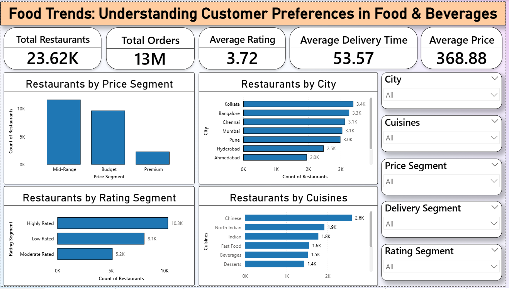
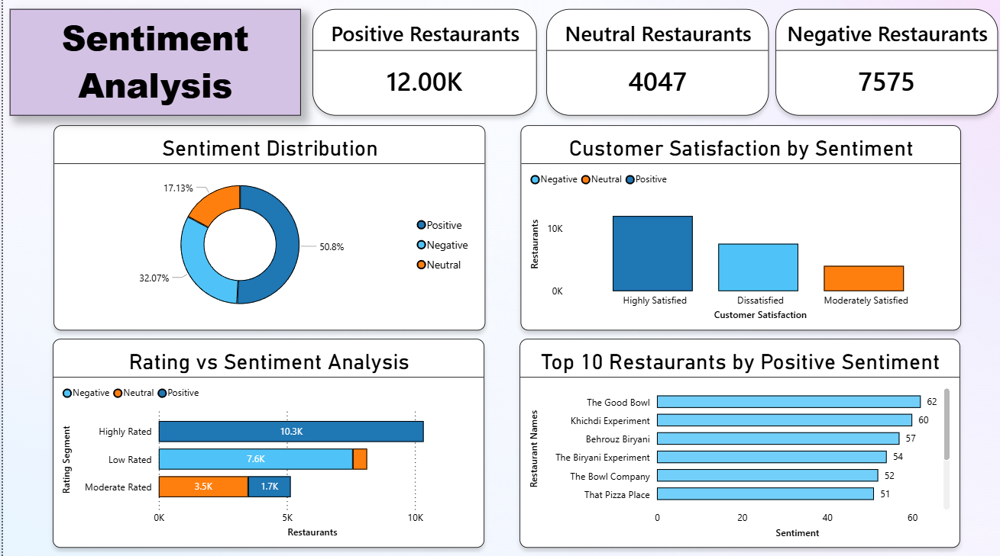
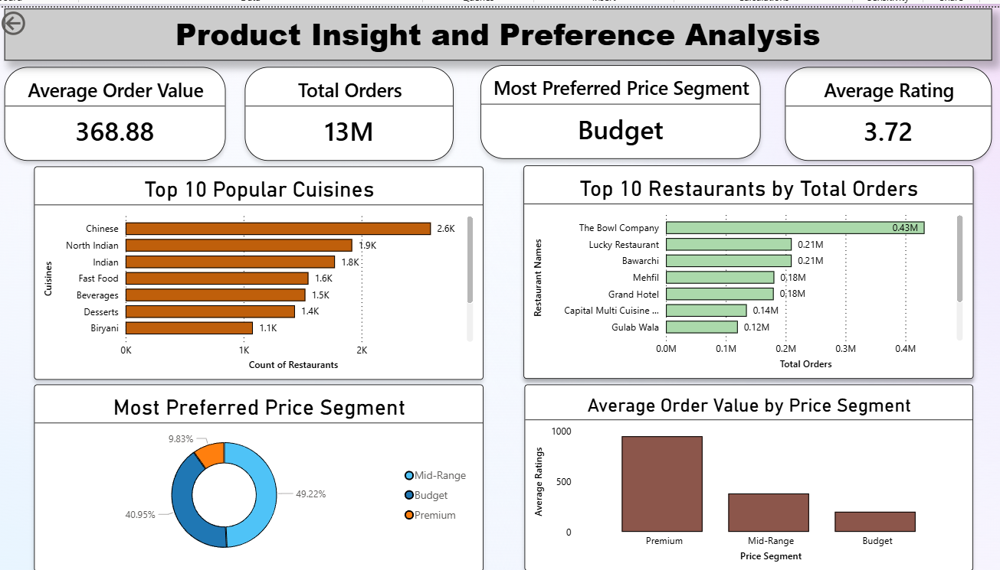
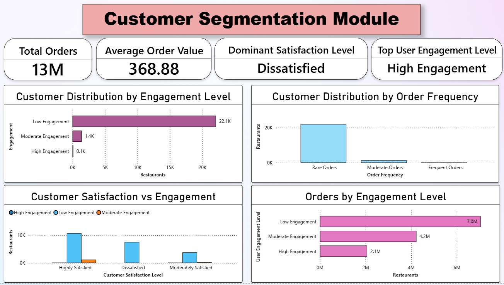
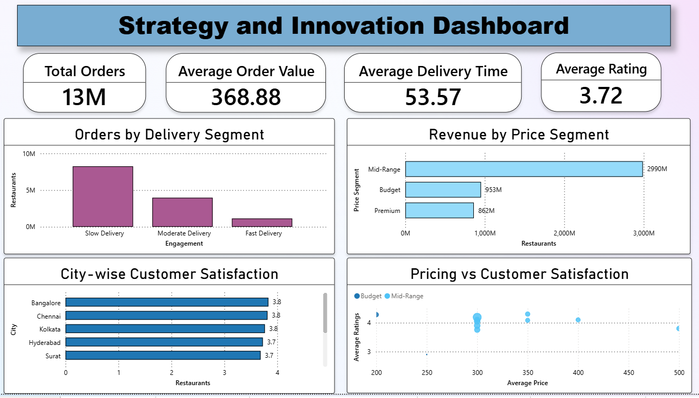
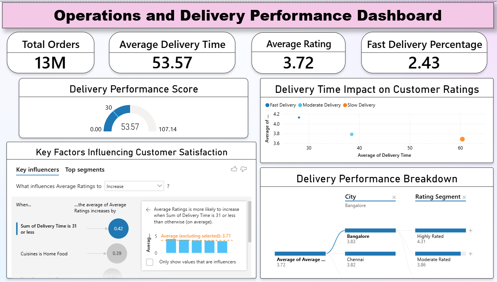
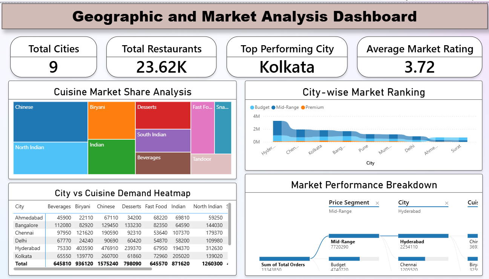

🍽️ Food Trends: Understanding Customer Preferences in Food & Beverages

🚀 Analyzed 23K+ restaurants and 4M+ ratings using Power BI to derive actionable business insights.

📌 Project Overview

This Power BI project provides a comprehensive analysis of food and beverage trends using restaurant, customer rating, pricing, delivery, and sentiment data. The dashboard enables businesses to understand customer preferences, evaluate restaurant performance, identify emerging food trends, and make data-driven decisions.

The analysis is based on 23,000+ restaurants and 4 million+ customer ratings, delivering valuable insights into customer behavior, market trends, operational efficiency, and business growth opportunities.

🎯 Objectives

- Analyze customer preferences across cuisines and restaurant categories.
- Evaluate the relationship between pricing and customer ratings.
- Understand customer sentiment patterns from restaurant reviews.
- Assess delivery performance and its impact on customer satisfaction.
- Identify high-performing restaurant segments and market opportunities.
- Generate actionable business recommendations using data visualization.

📊 Dashboard Modules

 1. Executive Overview

- Total Restaurants, Ratings, Average Price, Delivery Time
- City-wise restaurant distribution
- Rating and price category distribution

 2. Sentiment Analysis

- Positive, Neutral, Negative sentiment breakdown
- Sentiment across cities and price categories
- Relationship between sentiment and ratings

 3. Product Insight & Preference Analysis

- Top cuisines and their popularity
- Average ratings by cuisine
- Price vs Rating relationship

 4. Customer Segmentation

- Segmentation by rating, price, and delivery time
- Identification of high-performing restaurant categories

 5. Strategy & Innovation Dashboard

- Key performance indicators
- Business recommendations based on insights
- Growth opportunities and strategic recommendations

 6. Operations & Delivery Performance

- Delivery time analysis across restaurants
- Delivery performance segmentation
- Impact of delivery speed on customer ratings
- Operational efficiency monitoring

 7. Geographic & Market Analysis

- City-wise market distribution
- Restaurant concentration by region
- Regional rating and pricing trends
- Market performance comparison across cities

📈 Key Insights

- Mid-range restaurants dominate the market with the highest customer engagement.
- Chinese and Indian cuisines are among the most preferred food categories.
- Positive sentiment accounts for a majority of customer reviews.
- Faster delivery services are associated with higher customer ratings.
- Premium restaurants generally achieve higher ratings but attract a smaller customer base.
- Restaurant performance varies significantly across different cities and regions.

🚀 Business Recommendations

- Improve delivery efficiency to enhance customer satisfaction.
- Focus on competitive mid-range pricing strategies.
- Expand offerings in highly demanded cuisines.
- Monitor negative customer sentiment and implement quality improvements.
- Optimize operational processes to reduce delivery times.
- Leverage geographic insights for market expansion planning.

🛠️ Tools & Technologies Used

- Power BI Desktop
- Power Query
- DAX (Data Analysis Expressions)
- Data Modeling
- Data Visualization
- Business Intelligence Techniques

🔑 Skills Demonstrated

- Data Visualization
- Data Cleaning & Transformation
- Data Modeling
- Dashboard Design
- Business Intelligence
- Customer Behavior Analysis
- Sentiment Analysis
- KPI Development
- DAX Calculations
- Data Storytelling
  
📂 Dataset Information

The dataset includes:

- ID
- Restaurant Names
- Address
- Area
- City
- Cuisine
- Most Preferred
- Price
- Price Segment
- Most Preferred Price Segment
- Average Ratings
- Total Ratings
- Total Orders
- Rating Segment
- Average Order Value
- Order Frequency
- Delivery Time
- Delivery Segment
- Delivery Target
- Fast Delivery Orders
- Fast Delivery %
- Sentiment
- Top Performing City
- Revenue
- Customer Satistfaction Level
- Restaurant Popularity Level
- Restaurant Ranking Score
- User Engagement Level

📸 Dashboard Screenshots

Executive Overview

Sentiment Analysis

Product Insights

Customer Segmentation

Strategy & Innovation

Operational & Delivery Performance

Geographic & Market Analysis

📁 Project Structure

Food-Trends-Analysis/
│
├── Food Trends.pbix
├── dataset.csv
├── README.md
├── LICENSE
├── data_dictionary.md
├── project_report.pdf
│
└── screenshots/
    ├── executive_overview.png
    ├── sentiment_analysis.png
    ├── product_insights.png
    ├── customer_segmentation.png
    └── strategy_innovation.png
    ├── operational_delivery.png
    └── geographic_market_analysis.png

📄 License

This project is licensed under the MIT License - see the LICENSE file for details.

👨‍💻 Author

**Pooja Abasaheb More**
Final Year Computer Science Engineering Student

🌟 Acknowledgements

This project was developed as part of a data visualization and business intelligence learning initiative. It demonstrates practical applications of Power BI, data analytics, dashboard development, and business decision-making using real-world restaurant and customer preference data.
