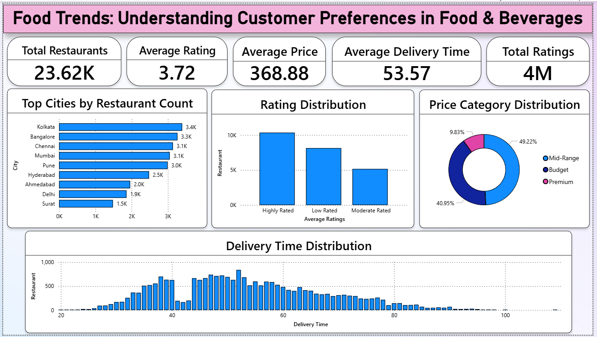
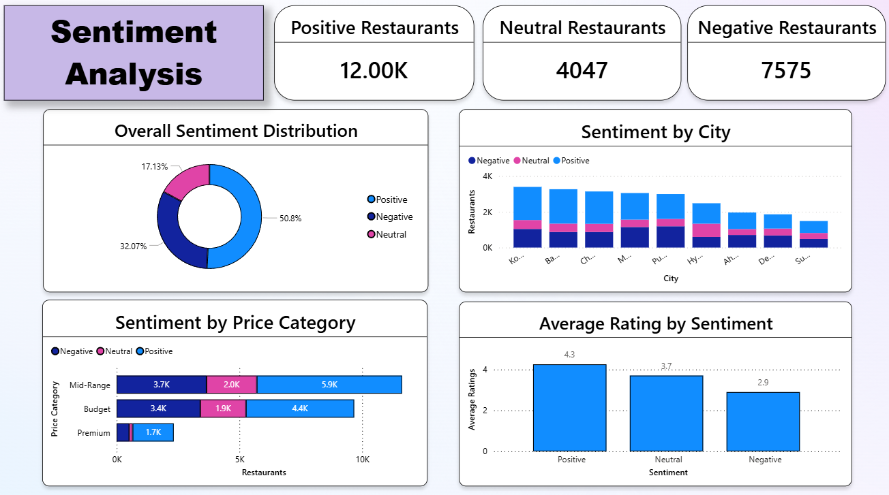
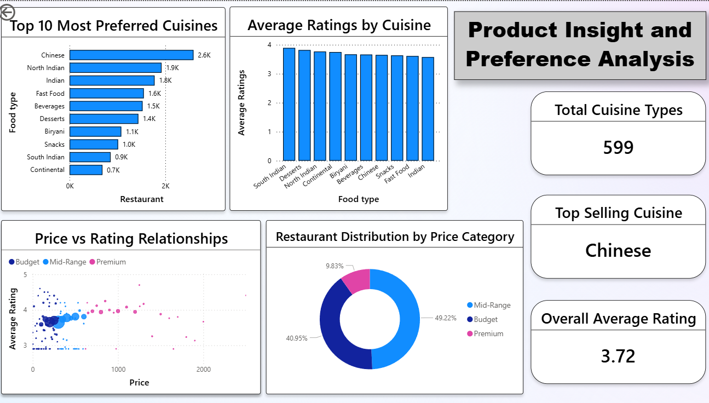
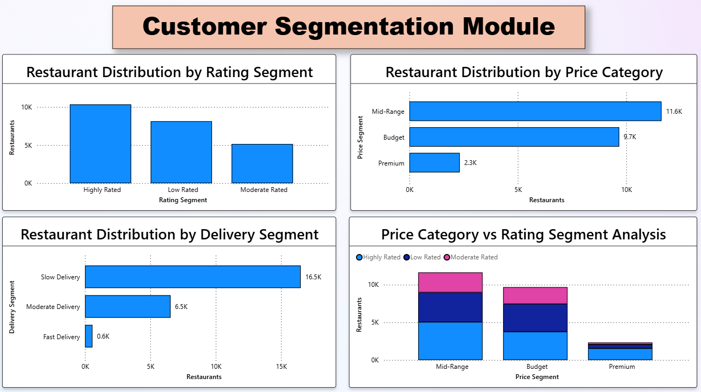
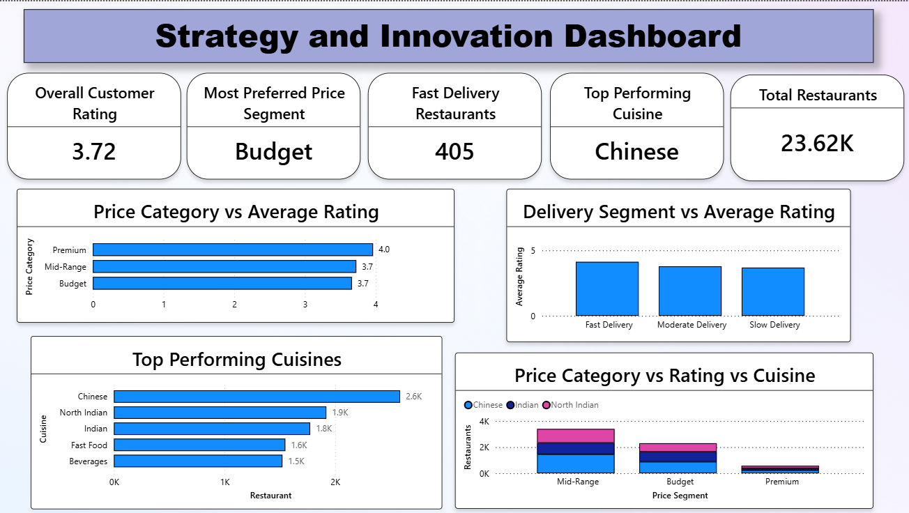

🍽️ Food Trends: Understanding Customer Preferences in Food & Beverages

🚀 Analyzed 23K+ restaurants and 4M+ ratings using Power BI to derive actionable business insights.

📌 Project Overview

This project presents an interactive Power BI dashboard that analyzes food trends, customer sentiment, pricing patterns, and restaurant performance across multiple cities.
The dashboard is built using a dataset of 23K+ restaurants and 4M+ customer ratings, providing meaningful insights into customer behavior and business opportunities in the food industry.

🎯 Objectives

- Analyze customer preferences across different cuisines
- Understand the impact of pricing on ratings
- Identify sentiment patterns (positive, neutral, negative)
- Evaluate delivery performance and its effect on satisfaction
- Provide actionable business insights for decision-making

📊 Dashboard Modules

1. Executive Overview

- Total Restaurants, Ratings, Average Price, Delivery Time
- City-wise restaurant distribution
- Rating and price category distribution

2. Sentiment Analysis

- Positive, Neutral, Negative sentiment breakdown
- Sentiment across cities and price categories
- Relationship between sentiment and ratings

3. Product Insight & Preference Analysis

- Top cuisines and their popularity
- Average ratings by cuisine
- Price vs Rating relationship

4. Customer Segmentation

- Segmentation by rating, price, and delivery time
- Identification of high-performing restaurant categories

5. Strategy & Innovation Dashboard

- Key performance indicators
- Business recommendations based on insights

📈 Key Insights

- Mid-range restaurants dominate the market (~49%)
- Chinese and Indian cuisines are the most preferred
- Positive sentiment accounts for ~51% of total reviews
- Delivery time significantly impacts customer ratings
- Premium restaurants have higher ratings but lower volume

🚀 Business Recommendations

- Improve delivery efficiency to enhance customer satisfaction
- Focus on mid-range pricing strategies for higher engagement
- Expand popular cuisines like Chinese and Indian
- Monitor and reduce negative sentiment through quality improvements
- Optimize operations for faster delivery services

🛠️ Tools & Technologies Used

- Power BI (Data Visualization)
- Power Query (Data Cleaning & Transformation)
- DAX (Data Analysis Expressions)

🔑 Skills Demonstrated

- Data Visualization
- Data Cleaning & Transformation
- Business Intelligence
- Dashboard Design
- Data Analysis using DAX

📂 Dataset Information

The dataset includes:

- ID
- Restaurant Name
- Address
- Area
- City
- Cuisine Type
- Most Preferred
- Price
- Price Segment
- Average Rating
- Total Ratings
- Rating Segment
- Delivery Time
- Delivery Segment
- Restaurant Sentiment

These dashboards provide a comprehensive analysis of food trends, customer behavior, and business insights.

📸 Dashboard Screenshots

Executive Overview

Sentiment Analysis

Product Insights

Customer Segmentation

Strategy & Innovation

📁 Project Structure

Food-Trends-Dashboard/
│
├── Dashboard.pbix
├── dataset.csv
├── README.md
├── LICENSE
├── data_dictionary.md
├── project_report.pdf
│
└── screenshots/
    ├── executive.png
    ├── sentiment.png
    ├── product.png
    ├── segmentation.png
    └── strategy.png

📄 License

This project is licensed under the MIT License - see the LICENSE file for details.

👨‍💻 Author

**Pooja Abasaheb More**
Final Year Computer Science Engineering Student

🌟 Acknowledgements

This project is created for learning and portfolio purposes to demonstrate data analysis, visualization, and business intelligence skills using Power BI.
